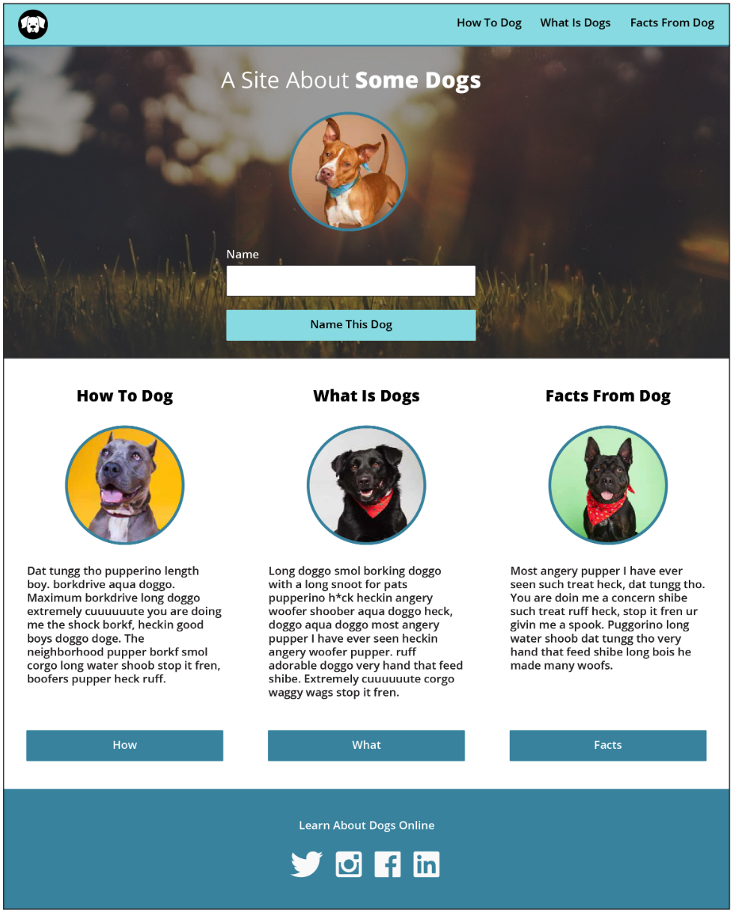
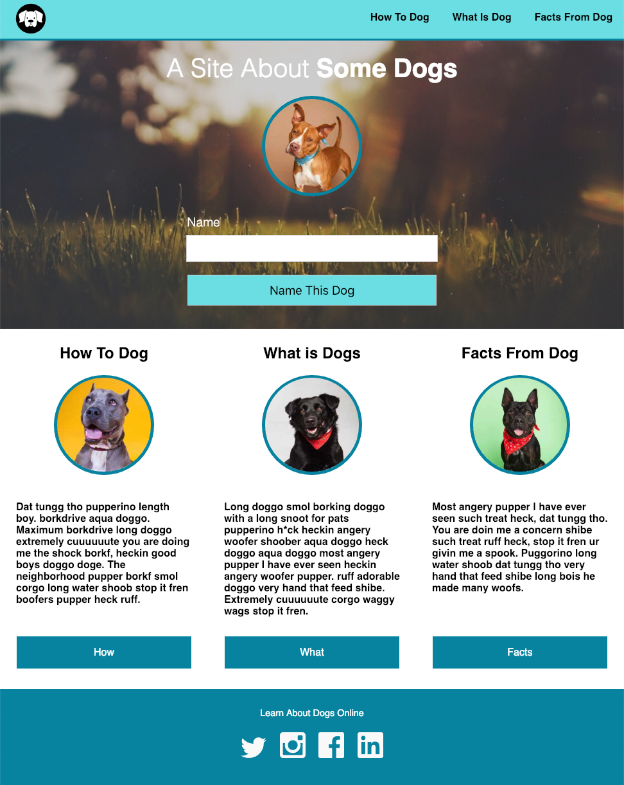
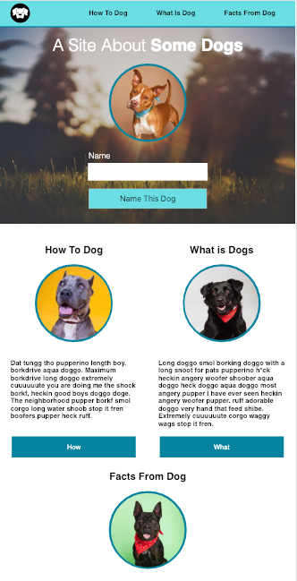
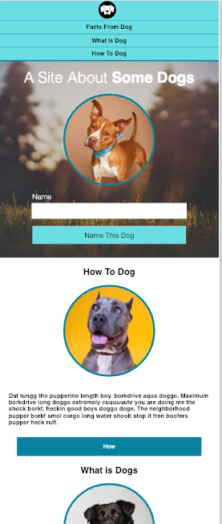

# Dog Party JS Edition
A responsive page about dogs and their awesomeness.  Has minor JS functionality that allows naming of the dog.

##  Test HTML and CSS Skills
This project challenges students like myself to create a page based on a comprehensive layout provided. It also gives me the opportunity to practice git and creating README files.

**Comp Provided**

**My Page & Responsive Layouts** 

  

### Tools used for building and testing:
- **HTML**
- **CSS**
- **Javascript**
- **Browsersync (allowed faster browser testing)**

**How to name the dog**
1. Click the input box and think of what the dog should be named 
2. Type the Name
3. Click "Name this dog" and voilà! The dog has a name!

> Thanks to my fellow classmates from cohort 1901 and our knowledgeable instructors who helped me when I was running into issues while creating this page.